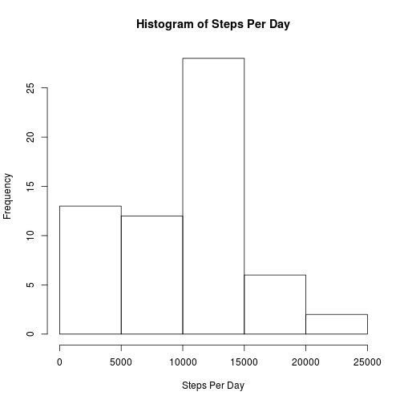
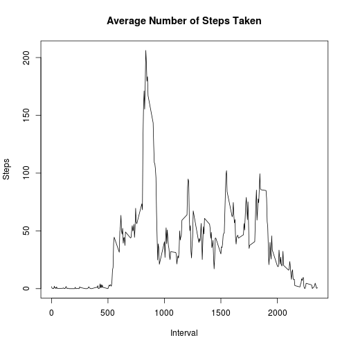
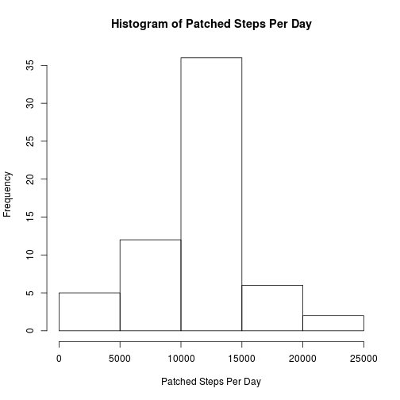
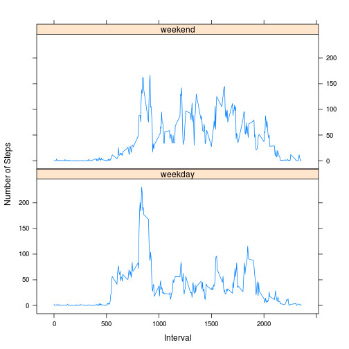

## Reproducable Research
## Course Project 1

### Loading and preprocessing the data

This code assumes that the activity.csv file is in the local directory.
Code is read into dataframe.  Date is kept as factor until later.


```r
library(lattice)
library(knitr)
##opts_knit$set(base.dir = 'figure') 
activityDF <- read.csv('activity.csv')
```

### What is the mean total number of steps taken per day
Dataframe is grouped by day with sum applied as summary statistic
Missing values are ignored as per instruction

```r
steps.per.day <- with(activityDF, tapply(steps, date, sum, na.rm=TRUE))
hist(steps.per.day, xlab='Steps Per Day', main='Histogram of Steps Per Day')
```



```r
cat('Mean Steps Per Day = ', mean(steps.per.day))
```

```
## Mean Steps Per Day =  9354.23
```

```r
cat('Median Steps Per Day = ', median(steps.per.day))
```

```
## Median Steps Per Day =  10395
```

### What is the average daily activity pattern


```r
steps.per.interval <- with(activityDF, tapply(steps, interval, mean, na.rm=TRUE))
plot(rownames(steps.per.interval), steps.per.interval, type="l", xlab='Interval', ylab='Steps', main='Average Number of Steps Taken')
```



The following code calculates the interval with max number of steps

```r
cat('Interval with Max Number of Steps = ', names(which.max(steps.per.interval)))
```

```
## Interval with Max Number of Steps =  835
```

### Imputing missing values

The following code defines a function *replaceNA* which is applied using the *apply* function row-wise to the data.  Any missing step values are replaced by the interval mean.


```r
cat('Total number of missing values in dataset = ', sum(is.na(activityDF)))
```

```
## Total number of missing values in dataset =  2304
```

```r
replaceNA = function(x) {
  if (is.na(x["steps"])) {
     i <- as.numeric(x["interval"])
     meanInterval <- steps.per.interval[as.numeric(rownames(steps.per.interval)) == i]
     as.numeric(meanInterval)
  } else {
    as.numeric(x["steps"]) 
  }
}

activityPatched <- activityDF
activityPatched$steps <- apply(activityDF, 1, replaceNA)

patched.steps.per.day <- with(activityPatched, tapply(steps, date, sum, na.rm=TRUE))
hist(patched.steps.per.day, xlab='Patched Steps Per Day', main='Histogram of Patched Steps Per Day')
```



```r
cat('Mean Patched Steps Per Day = ', mean(patched.steps.per.day))
```

```
## Mean Patched Steps Per Day =  10766.19
```

```r
cat('Median Patched Steps Per Day = ', median(patched.steps.per.day))
```

```
## Median Patched Steps Per Day =  10766.19
```

The calculations above show that patching the NA values with the interval mean value, both the mean and the median steps per day **increase**.  In addition, the histogram changes shape suggesting that the step data follows more of a normal distribution (which makes sense as most natural processes follow a normal or gaussian distribution).

### Activity Patterns between weekdays and weekends

Using the patched data, I delved into the activity pattern differences between weekday and weekends.  I first created a function, *dayType* which categorizes a date as weekend or weekday.  That function is then applied to the patched dataframe using the *tapply* function.  Finally the results are converted from matrix back into dataframe and then panel plots are displayed using lattice package.


```r
dayType = function(x) {
  if (weekdays(strptime(x["date"], format="%Y-%m-%d")) %in% list("Saturday", "Sunday")) {
    "weekend"
  } else {
    "weekday"
  }
}

activityPatched['day.type'] <- apply(activityPatched, 1, dayType)
activityPatched$day.type = as.factor(activityPatched$day.type)
steps.by.daytype <- with(activityPatched, tapply(steps, list(day.type, interval), mean))
steps.by.weekday.DF <- data.frame(steps=t(steps.by.daytype)[,"weekday"], interval=as.numeric(names(t(steps.by.daytype)[, "weekday"])), dayType = rep('weekday', 288))
steps.by.weekend.DF <- data.frame(steps=t(steps.by.daytype)[,"weekend"], interval=as.numeric(names(t(steps.by.daytype)[, "weekend"])), dayType = rep('weekend', 288))
steps.by.daytype.DF = rbind(steps.by.weekday.DF, steps.by.weekend.DF)
xyplot(steps~interval|factor(dayType), data=steps.by.daytype.DF, type='l', layout=c(1,2), xlab='Interval', ylab='Number of Steps')
```


